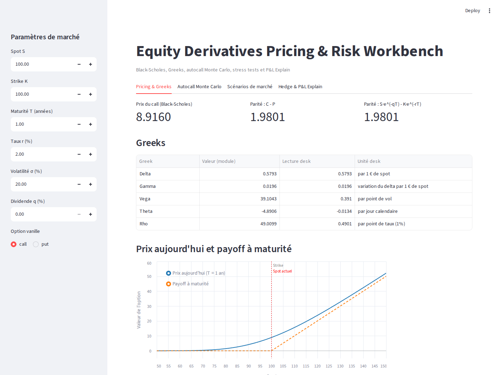
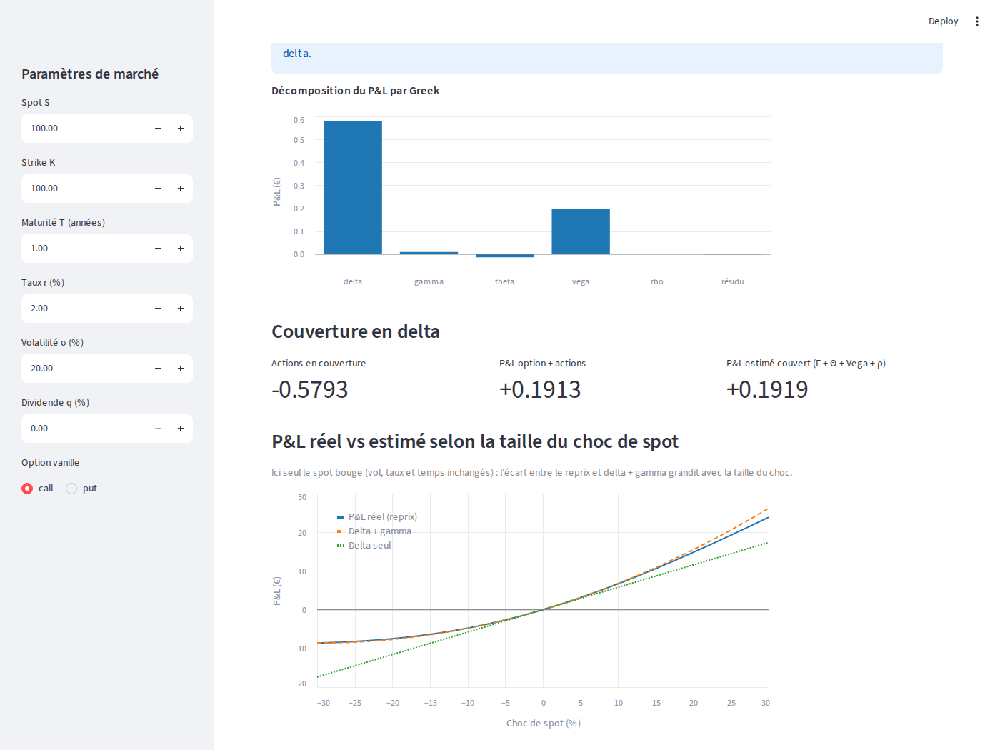

# Equity Derivatives Pricing & Risk Workbench

Petit outil Python de pricing et de risque sur options vanille et autocall : Black-Scholes, Greeks, Monte Carlo, stress tests et **P&L Explain** (P&L réel par reprix complet vs P&L estimé par les Greeks).

**App en ligne :** _lien à ajouter après le déploiement sur Streamlit Community Cloud_





---

## Objectif

Projet personnel réalisé pendant mon M1 finance de marché.

L'idée est de construire de bout en bout un outil simple mais cohérent : comment on price une option, ce que mesurent les Greeks, pourquoi un autocall se valorise par Monte Carlo, comment un desk mesure l'impact d'un choc de marché et réconcilie son P&L.

L'autocall est un produit signature des desks de produits structurés français, c'est pour ça qu'il a été choisi comme produit "exotique" du projet.

## Contenu

| Module | Contenu |
| --- | --- |
| `pricing/black_scholes.py` | `calculer_d1_d2`, `prix_call`, `prix_put` (avec dividende continu `q`) |
| `pricing/implied_vol.py` | Volatilité implicite par Newton-Raphson (avec contrôle des bornes de non-arbitrage) |
| `pricing/payoff.py` | Payoffs et P&L à maturité d'un call / put, graphique |
| `greeks/greeks.py` | Delta, gamma, vega, theta, rho analytiques ; delta par différence finie |
| `monte_carlo/autocall.py` | Simulation vectorisée (GBM), autocall trimestriel, prix, erreur standard, IC 95%, probabilités de rappel / perte, convergence |
| `risk/scenarios.py` | Stress tests spot / vol sur call, put et autocall (full repricing) |
| `risk/pnl_explain.py` | P&L réel vs P&L estimé par Taylor, résidu, couverture delta, balayage des chocs de spot |
| `app.py` | Interface Streamlit (4 onglets) |
| `tests/` | Tests pytest de chaque module + test de lancement de l'app |

## Installation et lancement

```bash
python -m venv venv
source venv/bin/activate          # Windows : venv\Scripts\activate
pip install -r requirements.txt

python -m pytest -v               # tous les tests
streamlit run app.py              # l'interface
```

Les modules se lancent depuis la racine, par exemple `python -m risk.pnl_explain`.

## Formules et conventions

**Black-Scholes** (dividende continu `q`) :

- `d1 = [ln(S/K) + (r - q + σ²/2)·T] / (σ·√T)` et `d2 = d1 - σ·√T`
- `Call = S·e^(-qT)·N(d1) - K·e^(-rT)·N(d2)`
- `Put = K·e^(-rT)·N(-d2) - S·e^(-qT)·N(-d1)`

**Unités des Greeks** (dérivées "brutes", sans conversion) :

| Greek | Convention dans le code | Lecture desk |
| --- | --- | --- |
| Delta | dV/dS | par 1 € de spot |
| Gamma | d²V/dS² | variation du delta par 1 € de spot |
| Vega | dV/dσ pour σ en décimal | vega / 100 = par point de vol |
| Theta | annuel, en temps calendaire (= -dV/dT) | theta / 365 = par jour |
| Rho | dV/dr pour r en décimal | rho / 100 = par point de taux |

**P&L Explain** (`risk/pnl_explain.py`) :

- P&L réel = prix après choc - prix avant choc (reprix complet)
- P&L estimé = Δ·ΔS + ½·Γ·ΔS² + Θ·Δt + Vega·Δσ + ρ·Δr, avec les Greeks calculés au point de départ
- Résidu = P&L réel - P&L estimé : termes d'ordre supérieur (convexité au-delà du gamma) et effets croisés (spot/vol)
- Chocs : spot relatif (`-0.10` = -10%), vol et taux en absolu (`0.01` = +1 point), temps en jours calendaires (`Δt = jours / 365`)

Exemple sur un call ATM 1 an (S = K = 100, σ = 20%, r = 2%) : sur un petit mouvement (spot +1%, vol +0.5 pt, 1 jour) le résidu est d'environ 0.1% du P&L réel ; sur un gros choc (spot -15%, vol +5 pts, 5 jours) il monte à environ 7%, seul le reprix complet est alors fiable.

**Autocall simplifié** (nominal = S0) :

- Observations à 3, 6, 9 et 12 mois ; rappel si le sous-jacent est ≥ S0
- Coupon de 2% du nominal par trimestre écoulé, payé au rappel
- À maturité sans rappel : nominal + coupons si S_T ≥ 60% de S0, sinon nominal × S_T / S0
- Prix = moyenne des cash-flows actualisés (`e^(-r·t)` à la date de paiement)

Avec S0 = 100, r = 2%, σ = 20%, 50 000 trajectoires et seed = 42 : prix ≈ 102.98 (erreur standard ≈ 0.017), rappel anticipé ≈ 69%, perte en capital ≈ 0.5%.

Pour les stress tests de l'autocall, les prix avant et après choc utilisent la **même seed et le même nombre de trajectoires** (nombres aléatoires communs) : la variation mesure l'effet du choc et pas le bruit Monte Carlo.

## Hypothèses et limites du modèle

Le projet est volontairement limité. Ce qu'il ne fait pas, et qu'un vrai pricer de desk ferait :

- Volatilité constante : pas de smile ni de surface de vol, pas de vol stochastique
- Pas de calibration sur des prix cotés
- Taux constant, pas de courbe de taux ; dividende continu constant
- Autocall simplifié : observations discrètes trimestrielles, term sheet fixe (coupon non calibré pour pricer au pair, d'où un prix > 100)
- Pas de risque de crédit de l'émetteur, de funding ni de XVA
- Pas de coûts de transaction ni de coûts de couverture
- Couverture delta statique sur un seul pas (pas de rebalancement)
- Greeks de l'autocall non calculés (seulement des stress tests par reprix Monte Carlo)

## Tests

```bash
python -m pytest -v
```

Les tests couvrent la parité call-put, les cas limites (vol quasi nulle, maturité très courte, spot = strike, paramètres invalides), la volatilité implicite, les Greeks analytiques contre différences finies, l'autocall (cas déterministes, reproductibilité, convergence), les stress tests et le P&L Explain (sens du P&L, unités de chaque Greek, qualité de l'approximation, couverture delta).

## Déploiement (Streamlit Community Cloud)

1. Pousser le repo sur GitHub (avec `app.py` et `requirements.txt` à la racine).
2. Sur [share.streamlit.io](https://share.streamlit.io), se connecter avec GitHub, "New app", choisir le repo, la branche et `app.py`.
